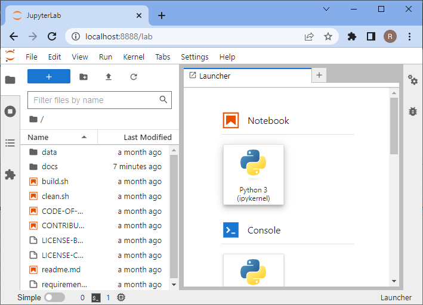

# Den Computer einrichten

Dieses Kapitel enthält Anweisungen zur Einrichtung Ihres Computers, um Python zur Analyse von Bildern auszuführen.

# Python und Conda-Umgebungen einrichten
Bei der Arbeit mit Python werden wir viele Plugins und Software-Bibliotheken verwenden, die organisiert werden müssen.
Eine Möglichkeit dafür ist die Verwaltung von *Conda*-Umgebungen.
Eine Conda-Umgebung kann als virtueller Desktop oder virtueller Computer betrachtet werden, auf den über das Terminal zugegriffen werden kann. 
Wenn Sie Software in einer Conda-Umgebung installieren, ist sie möglicherweise von einer anderen Umgebung aus nicht zugänglich. 
Wenn eine Conda-Umgebung beschädigt wird, z.B. durch die Installation inkompatibler Software, können Sie einfach eine neue erstellen und von vorn beginnen.

Siehe auch
* [Erste Schritte mit Mambaforge und Python](https://biapol.github.io/blog/mara_lampert/getting_started_with_mambaforge_and_python/readme.html)
* [Verwaltung wissenschaftlicher Python-Umgebungen mit Conda, Mamba und Co.](https://focalplane.biologists.com/2022/12/08/managing-scientific-python-environments-using-conda-mamba-and-friends/)
* [Wissenschaftliche Datenanalyse mit Python](https://youtu.be/MOEPe9TGBK0)

## Schritt 1: Mambaforge installieren
Laden Sie Conda herunter und installieren Sie es. Wir empfehlen die Conda-Distribution [Mambaforge](https://github.com/conda-forge/miniforge#mambaforge).

Für eine einfache Handhabung wird empfohlen, es nur für Ihren eigenen Gebrauch zu installieren und Conda während der Installation zur PATH-Variable hinzuzufügen.


## Schritt 2: devbio-napari installieren

Wir empfehlen die Installation von [devbio-napari](https://github.com/haesleinhuepf/devbio-napari), einer Distribution von napari mit einer Reihe von Plugins für die Biobildanalyse.

Verwenden Sie diesen Befehl im Terminal:

```
mamba create --name devbio-napari-env python=3.9 devbio-napari -c conda-forge
```

**Tipp**: Es wird empfohlen, für jedes Projekt, das Sie ausführen, eine eigene Umgebung zu erstellen. 
Auf diese Weise können installierte Software-Bibliotheken und Tools sich nicht gegenseitig beeinträchtigen.

## Schritt 3: Die Installation testen

Anschließend können Sie die Umgebung betreten, um damit zu arbeiten. 
Wenn Sie wieder am selben Projekt arbeiten möchten, sollten Sie eine Kommandozeile starten und Folgendes eingeben:

```
mamba activate devbio-napari-env
```

Starten Sie [Jupyter lab](https://jupyter.org/) vom Terminal aus wie folgt:

```
jupyter lab
```

Ein Browser wird geöffnet und zeigt Ihnen die folgende Webseite. Klicken Sie im Abschnitt `Notebook` auf "Python 3 (ipykernel)", um ein neues Notebook zu erstellen:



Klicken Sie im neuen Notebook in die erste Code-Zelle, geben Sie `print("Hello world")` ein und drücken Sie SHIFT+ENTER auf Ihrer Tastatur. 
Wenn alles richtig installiert ist, sollte es so aussehen:


Um zu testen, ob Ihr Grafikkartentreiber korrekt installiert ist, geben Sie diesen Code ein:

```
import pyclesperanto_prototype as cle

cle.get_device()
```


## Fehlerbehebung: Grafikkartentreiber

Falls Fehlermeldungen wie "ImportError: DLL load failed while importing cl: The specified procedure could not be found" [siehe auch](https://github.com/clEsperanto/pyclesperanto_prototype/issues/55) oder "clGetPlatformIDs failed: PLATFORM_NOT_FOUND_KHR" auftreten, installieren Sie bitte aktuelle Treiber für Ihre Grafikkarte und/oder OpenCL-Gerät. 

Wählen Sie die richtige Treiberquelle abhängig von Ihrer Hardware aus dieser Liste:

* [AMD-Treiber](https://www.amd.com/en/support)
* [NVidia-Treiber](https://www.nvidia.com/download/index.aspx)
* [Intel GPU-Treiber](https://www.intel.com/content/www/us/en/download/726609/intel-arc-graphics-windows-dch-driver.html)
* [Intel CPU OpenCL-Treiber](https://www.intel.com/content/www/us/en/developer/articles/tool/opencl-drivers.html#latest_CPU_runtime)
* [Microsoft Windows OpenCL-Unterstützung](https://www.microsoft.com/en-us/p/opencl-and-opengl-compatibility-pack/9nqpsl29bfff)

Manchmal müssen Mac-Benutzer Folgendes installieren:

    mamba install -c conda-forge ocl_icd_wrapper_apple

Manchmal müssen Linux-Benutzer Folgendes installieren:

    mamba install -c conda-forge ocl-icd-system

## Fehlerbehebung: DLL load failed

Im Falle von Fehlermeldungen wie dieser:
```
[...] _get_win_folder_with_pywin32
from win32com.shell import shellcon, shell
ImportError: DLL load failed while importing shell: The specified procedure could not be found.
```

Versuchen Sie diesen Befehl innerhalb der Basisumgebung:

```
conda activate base

pip install --upgrade pywin32==228
```

[Quelle](https://github.com/conda/conda/issues/11503)