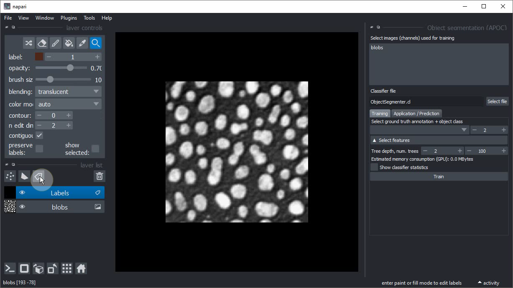
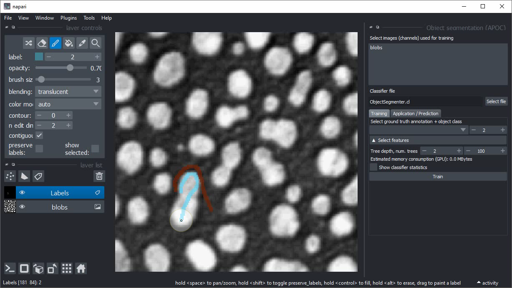
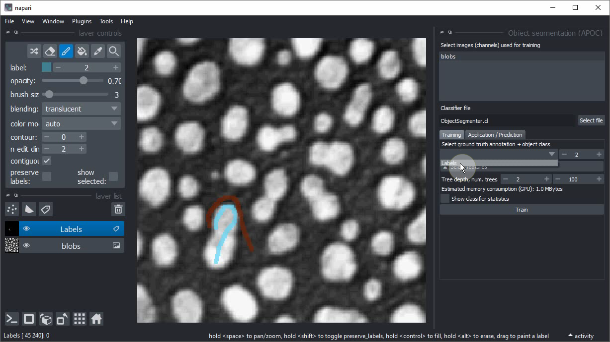
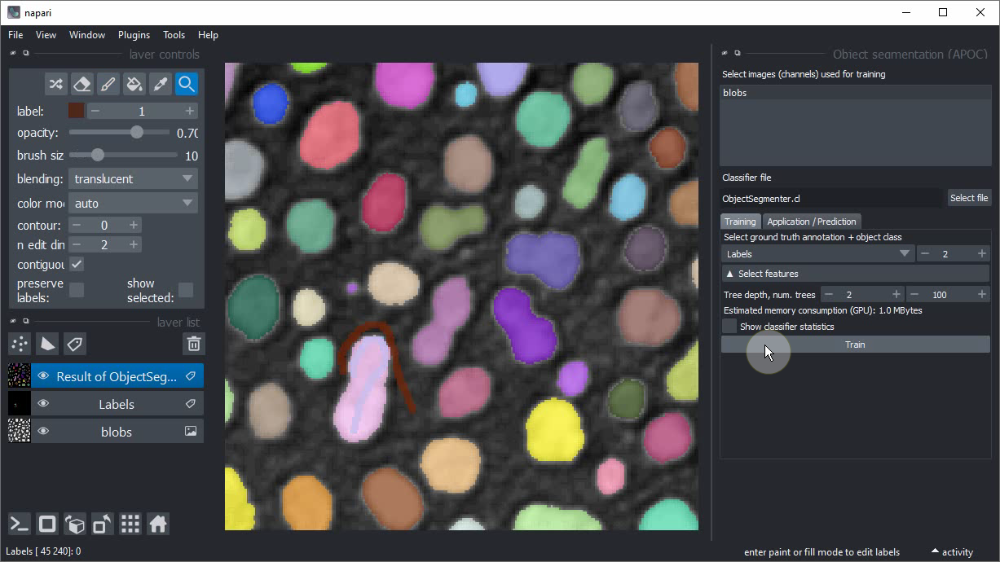

(machine_learning:pixel_classification)=
# Interaktive Pixelklassifikation und Objektsegmentierung in Napari

In dieser Übung werden wir einen [Random Forest Classifier](https://en.wikipedia.org/wiki/Random_forest) für die Pixelklassifikation trainieren und das Ergebnis in eine Instanzsegmentierung umwandeln.
Wir werden das Napari-Plugin [napari-accelerated-pixel-and-object-classification](https://www.napari-hub.org/plugins/napari-accelerated-pixel-and-object-classification) verwenden.

## Erste Schritte

Öffnen Sie ein Terminalfenster und aktivieren Sie Ihre Conda-Umgebung:

```
conda activate devbio-napari-env
```

Starten Sie anschließend Napari:

```
napari
```

Laden Sie den "Blobs"-Beispieldatensatz aus dem Menü `File > Open Sample > clEsperanto > Blobs (from ImageJ)`


## Pixelklassifikation und Objektsegmentierung in Napari

Zur Segmentierung von Objekten können wir das Objektsegmentierungswerkzeug in APOC verwenden.
Im Hintergrund verwendet es einen Pixelklassifikator und [Connected Component Labeling](https://en.wikipedia.org/wiki/Connected-component_labeling).
Die folgende Vorgehensweise wird auch in [diesem Video](apoc_object_segmentation.mp4) gezeigt.

Starten Sie die Objektsegmentierung aus dem Menü `Tools > Segmentation / Labeling > Object Segmentation (APOC)`.


Fügen Sie eine neue Ebene für Beschriftungen hinzu, indem Sie auf diesen Button klicken:


Ändern Sie die Pinselgröße auf eine kleine Zahl wie 2 oder 3.


Klicken Sie auf den `Paint brush` Button.


Beginnen Sie mit der Annotation des `Hintergrunds`, wo sich kein Objekt befindet.


Erhöhen Sie die zu zeichnende Beschriftung um eins.


Zeichnen Sie eine Annotation innerhalb der interessierenden Objekte. Zeichnen Sie Hintergrund- und Objektannotationen nah beieinander. Je näher diese beiden Annotationen gezeichnet werden, desto geringer ist der Freiheitsgrad, den der Computer später bei der Optimierung des Modells hat.


Wählen Sie in der Benutzeroberfläche `Object segmentation` auf der rechten Seite das zu verarbeitende Bild/den zu verarbeitenden Kanal aus.


Wählen Sie auch das Annotationsbeschriftungsbild aus, das Sie gerade gezeichnet haben.


Klicken Sie auf `Train`. Ein Beschriftungsbild sollte erscheinen.


Wenn die Segmentierung gut funktioniert, sollten Sie erwägen, eine Sicherungskopie der gespeicherten `ObjectSegmenter.cl`-Datei zu erstellen.
Wenn Sie den Dateispeicherort vor dem Training nicht geändert haben, befindet sie sich in dem Ordner, von dem aus Sie Napari in der Befehlszeile gestartet haben.