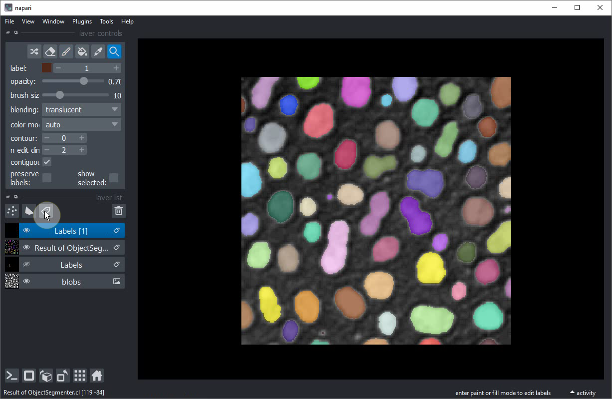
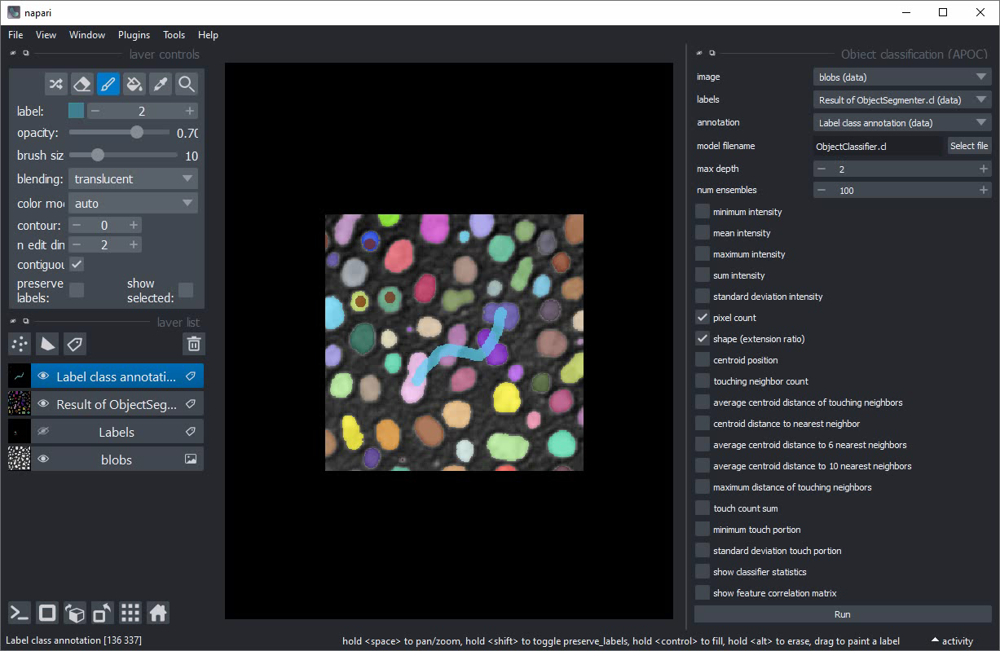
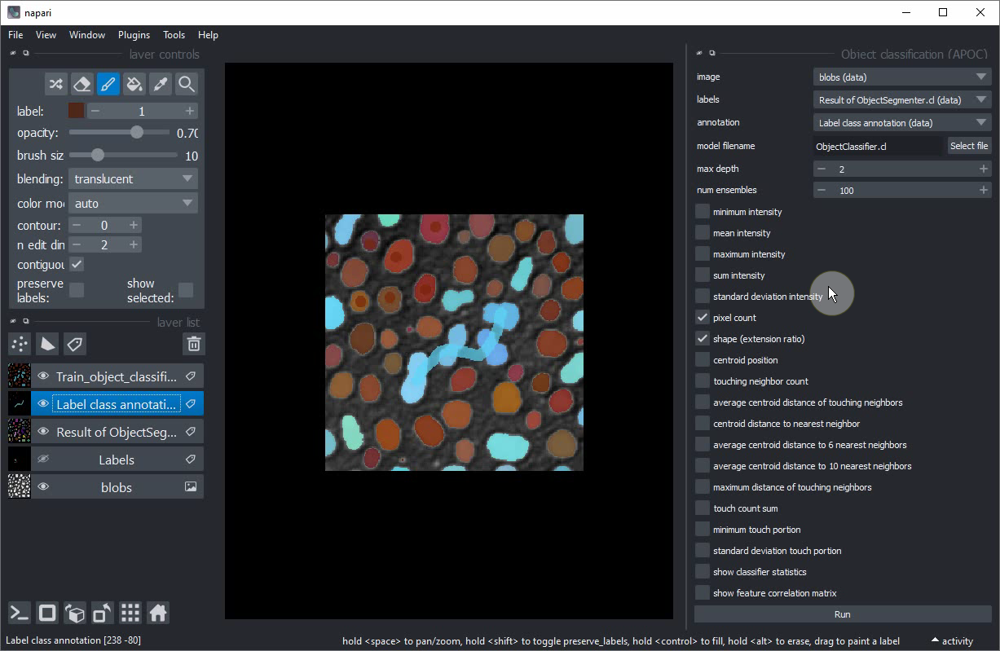

# Interaktive Objektklassifizierung in Napari

In dieser Übung werden wir einen [Random Forest Classifier](https://en.wikipedia.org/wiki/Random_forest) für die Klassifizierung segmentierter Objekte trainieren. 
Wir werden das Napari-Plugin [napari-accelerated-pixel-and-object-classification](https://www.napari-hub.org/plugins/napari-accelerated-pixel-and-object-classification) verwenden.

## Erste Schritte

Öffnen Sie ein Terminalfenster und aktivieren Sie Ihre Conda-Umgebung:

```
conda activate devbio-napari-env
```

Starten Sie anschließend Napari:

```
napari
```

Laden Sie den "Blobs"-Beispieldatensatz aus dem Menü `File > Open Sample > clEsperanto > Blobs (from ImageJ)`

Wir benötigen außerdem ein Labelbild. Sie können es mit dem [zuvor trainierten Pixelklassifikator](machine_learning:pixel_classification) erstellen 
oder über das Menü `Tools > Segmentation / labeling > Gauss-Otsu Labeling (clesperanto)`.

## Objektklassifizierung

Unser Ausgangspunkt ist ein geladenes Bild und ein Labelbild mit segmentierten Objekten. Die folgende Vorgehensweise wird auch in [diesem Video](apoc_object_classification.mp4) gezeigt.



Fügen Sie ein weiteres Labelbild hinzu. Benennen Sie das Labelbild z.B. in `Label class annotation` um, damit es nicht mit dem anderen verwechselt wird.


Aktivieren Sie das `Brush tool`.


Setzen Sie kleine Punkte mit Label `1` in kleine rundliche Objekte (zu Trainingszwecken: wirklich nur die kleineren).


Erhöhen Sie das `label` auf `2`.


Zeichnen Sie eine Linie durch die größeren länglichen Objekte in der Bildmitte.


Starten Sie das Objektklassifizierungstool aus dem Menü `Tools > Segmentation post-processing > Object classification (APOC)`


Aktivieren Sie in dieser Benutzeroberfläche das Kontrollkästchen `shape`.


Wählen Sie `image`, `labels` und `annotation` wie folgt aus:


Klicken Sie auf `Run`. Nach einer Sekunde sollte eine neue Labelebene mit braun / blau annotierten Objekten erscheinen. Einige größere runde Objekte werden unbeabsichtigt blau sein.


Blenden Sie die neu erstellte Klassifizierungsebene aus.


Wählen Sie Ihre Annotationsebene aus.


Annotieren Sie weitere rundliche Objekte, diesmal die größeren.


Trainieren Sie den Klassifikator erneut.


Wenn Sie mit dem trainierten Klassifikator zufrieden sind, kopieren Sie die Datei an einen sicheren Ort. Beim Training des nächsten Klassifikators könnte dieser überschrieben werden.

## Zusatzübung
Trainieren Sie den Klassifikator neu, sodass er drei verschiedene Klassen unterscheiden kann:
* Kleine runde Objekte
* Große runde Objekte
* Große längliche Objekte